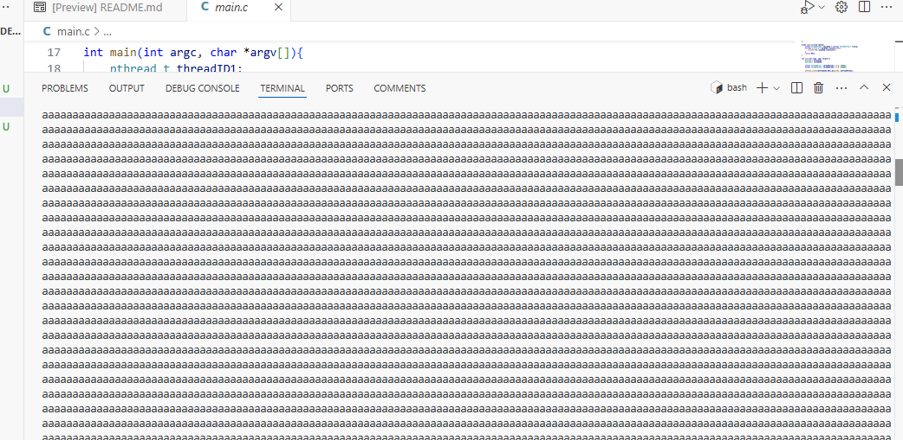
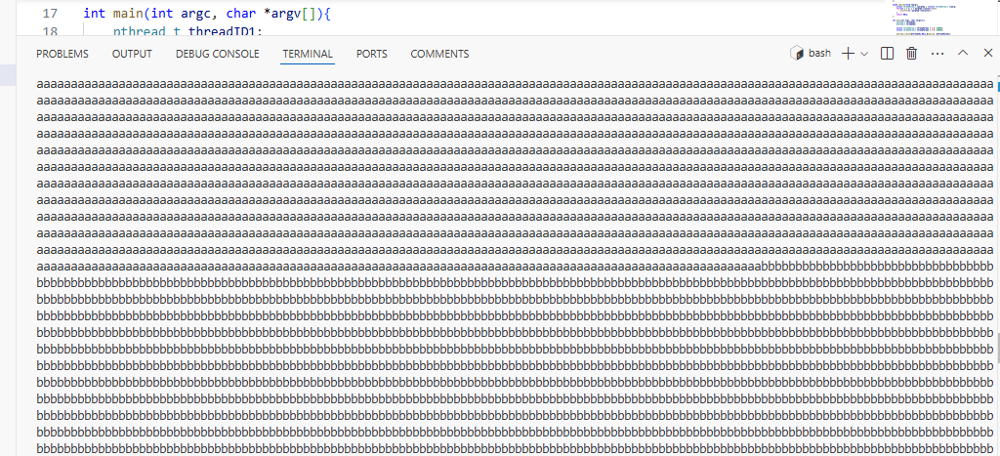
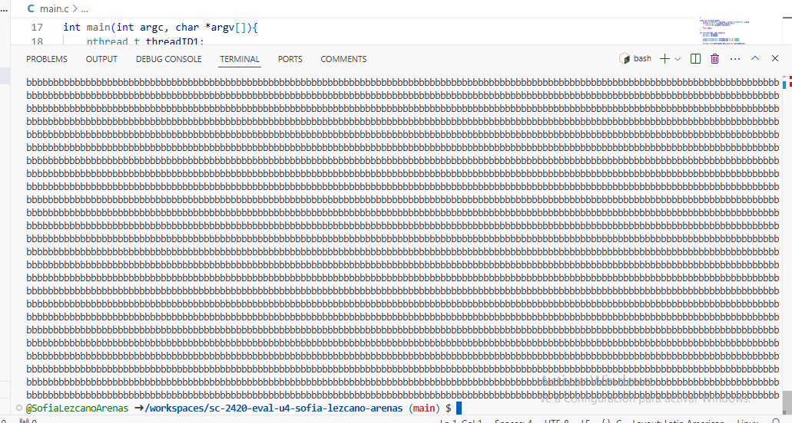
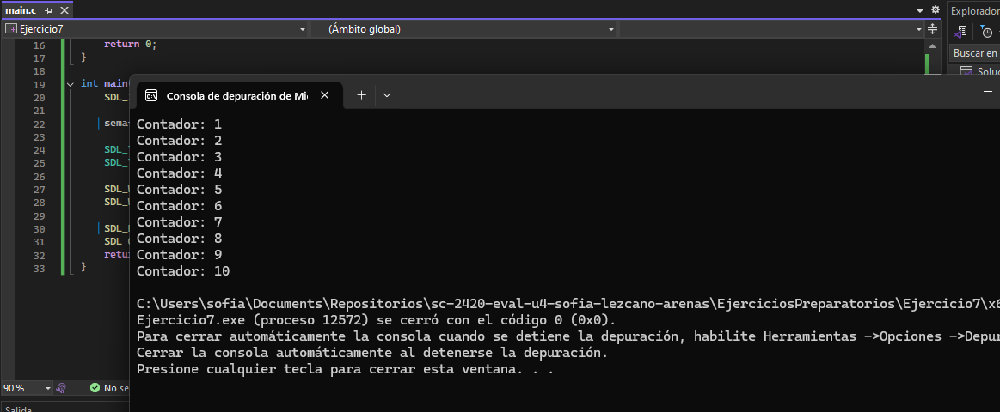
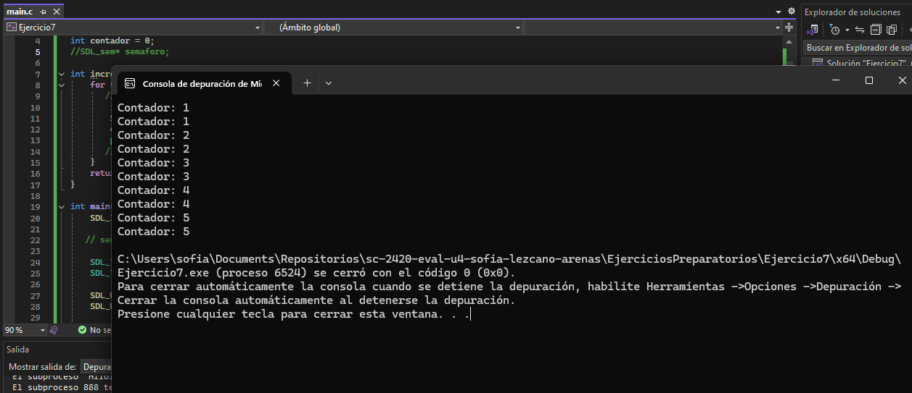
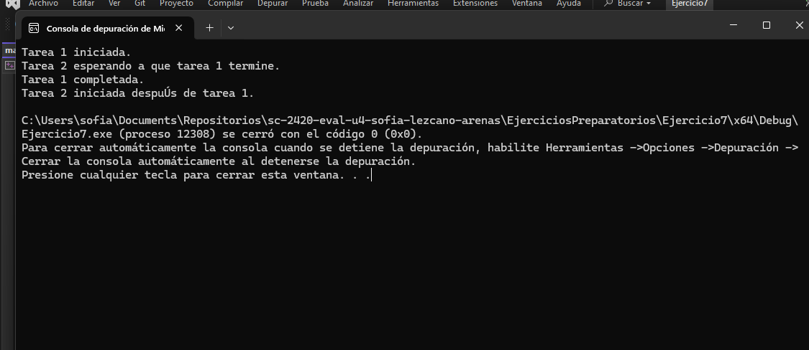
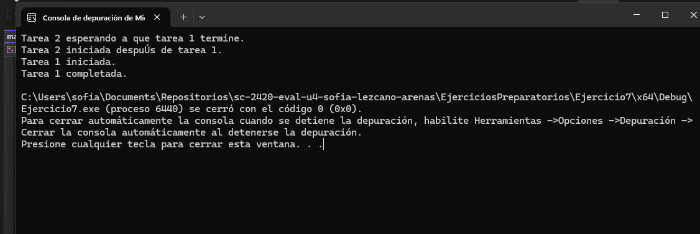

# Ejercicios preparatorios
Dados algunos problemas tratando de realizar los ejercicios en Visual Studio, continuaré utilizando Codespaces.

## Ejercicio 6: esperar un hilo
En el ejercicio 5 el programa terminaba independientemente de si los hilos habían terminado sus tareas o no. Para solucionarlo, hay que esperar a que terminen los procesos que se les han encargado antes de acabar el programa.

``` C
#include <stdio.h>
#include <stdlib.h>
#include <pthread.h>
struct threadParam_t{
    char character;
    int counter;
};

void* imprime(void *parg){
    struct threadParam_t *pargTmp = (struct threadParam_t *)parg;
    for(int i = 0; i < pargTmp->counter;i++){
        printf("%c",pargTmp->character);
    }
    return NULL;
}

int main(int argc, char *argv[]){
    pthread_t threadID1;
    pthread_t threadID2;

    struct threadParam_t threadParam1 = {'a',30000};
    struct threadParam_t threadParam2 = {'b',20000};

    pthread_create(&threadID1,NULL,&imprime, &threadParam1);
    pthread_create(&threadID2,NULL,&imprime, &threadParam2);

    pthread_join(threadID1,NULL);
    pthread_join(threadID2,NULL);

    exit(EXIT_SUCCESS);
}
```
La función `pthread_join` se utiliza para esperar a que un hilo termine su ejecución. Esta se asegura de que el hilo principal (en este caso, el que ejecuta **main**) no continúe hasta que los hilos especificados (**threadID1** y **threadID2**) hayan finalizado. Esto es crucial para garantizar que todos los resultados de los hilos se completen antes de que el programa finalice.

Para que un hilo en particular pueda terminar, debe incluirse la siguiente línea de código luego de haberlo creado con los argumentos especificados.

``` C
pthread_join(identificadorHilo,valorDeRetornoHilo);
```

**Resultado de la ejecución del programa**






**Diferencia entre los siguientes fragmentos de código**

**1).**
``` C
pthread_create(&threadID1,NULL,&imprime, &threadParam1);
pthread_join(threadID1,NULL);
pthread_create(&threadID2,NULL,&imprime, &threadParam2);
pthread_join(threadID2,NULL);
```

**2).**
``` C
pthread_create(&threadID1,NULL,&imprime, &threadParam1);
pthread_create(&threadID2,NULL,&imprime, &threadParam2);
pthread_join(threadID1,NULL);
pthread_join(threadID2,NULL);
```
Teniendo en cuenta lo que hace la función `pthread_join`, podría decirse que mientras que en **1** se crea el hilo threadID1 y se espera que termine antes de poder crear el hilo threadID2 y también esperar que termine, en **2** se crean ambos hilos y luego se espera a que termine threadID1, para luego esperar a que termine threadID2.

## Ejercicio 7: para pensar
Para luego poder crear hilos en el juego y manejarlos con SDL2, es clave tener la siguiente información:

### ¿Cómo se crea un hilo?
Para crear un hilo en SDL2, se utiliza la función `SDL_CreateThread`. Esta función toma como argumentos el nombre de la función que se ejecutará en el hilo, un puntero a un argumento que se pasará a esa función, y un puntero para recibir la identificación del hilo.
### Ejemplo
```C
#include <SDL.h>
#include <stdio.h>

//Función que ejecutará el hilo
int threadFunction(void *data) {
    int *num = (int *)data;
    for (int i = 0; i < 5; i++) {
        printf("Hilo: %d, Iteración: %d\n", *num, i);
        SDL_Delay(500); // Pausa la ejecución del hilo durante 500 milisegundos (0.5 segundos)
    }
    return 0;
}

int main(int argc, char *argv[]) {
    SDL_Init(SDL_INIT_EVERYTHING); // Inicializa todas las subsistemas de SDL
    
    int threadData = 1; // Crea una variable entera que se pasará al hilo
    
    SDL_Thread *thread = SDL_CreateThread(threadFunction, "MiHilo", &threadData);
    
    // Esperar a que el hilo termine
    SDL_WaitThread(thread, NULL);
    
    SDL_Quit();
    return 0;
}
```
### ¿Cuál es el equivalente de `join` en la API de SDL2?
En SDL2, la función `SDL_WaitThread` es el equivalente de join. Esta función espera a que el hilo termine, bloqueando el hilo principal hasta que el hilo específico finalice.
### Ejemplo
```C
#include <SDL.h>
#include <stdio.h>

int threadFunction(void *data) {
    int *num = (int *)data;
    for (int i = 0; i < 5; i++) {
        printf("Hilo en ejecución: %d\n", *num);
        SDL_Delay(500); 
    }
    return 0;
}

int main(int argc, char *argv[]) {
    SDL_Init(SDL_INIT_EVERYTHING); 
    
    int threadData = 1;
    
    SDL_Thread *thread = SDL_CreateThread(threadFunction, "MiHilo", &threadData);
    
    // Esperar a que el hilo termine
    SDL_WaitThread(thread, NULL);
    
    SDL_Quit();
    return 0;
}
```
### ¿Para qué sirven los semáforos en SDL2?
En SDL2, los semáforos (mediante `SDL_Sem*`) ayudan a sincronizar el acceso a recursos compartidos entre hilos, evitando condiciones de carrera.
### ¿Qué es una condición de carrera?
 Es cuando múltiples hilos intentan acceder a la misma variable o recurso sin la debida sincronización, generando resultados inesperados.
### Ejemplo de semáforo que evita una condición de carrera
``` C
#include <SDL.h>
#include <stdio.h>

int contador = 0;
SDL_sem* semaforo;

int incrementarContador(void* data) {
    for (int i = 0; i < 5; ++i) {
        SDL_SemWait(semaforo);  // Entrada en sección crítica
        int temp = contador;
        SDL_Delay(50);          // Simula trabajo en sección crítica
        contador = temp + 1;
        printf("Contador: %d\n", contador);
        SDL_SemPost(semaforo);  // Salida de sección crítica
    }
    return 0;
}

int main() {
    SDL_Init(SDL_INIT_VIDEO);

    semaforo = SDL_CreateSemaphore(1);

    SDL_Thread* thread1 = SDL_CreateThread(incrementarContador, "Hilo1", NULL);
    SDL_Thread* thread2 = SDL_CreateThread(incrementarContador, "Hilo2", NULL);

    SDL_WaitThread(thread1, NULL);
    SDL_WaitThread(thread2, NULL);

    SDL_DestroySemaphore(semaforo);
    SDL_Quit();
    return 0;
}
```
El resultado de este programa, que es el esperado es:


Si en el ejemplo se comentan todas las líneas que tienen que ver con el semáforo, el resultado es el siguiente:


La condición de carrera que el semáforo evita en este ejemplo es la modificación concurrente de la variable contador. Sin el semáforo, los dos hilos (thread1 y thread2) podrían leer y escribir en contador al mismo tiempo (lo que se observa en la anterior imagen), lo cual generaría resultados incorrectos debido a los siguientes pasos que podrían ocurrir en paralelo:

- Un hilo lee el valor actual de contador.
- Otro hilo también lee el mismo valor de contador antes de que el primer hilo lo modifique.
- Ambos hilos incrementan el valor que leyeron y escriben el nuevo valor en contador.
- Esto provoca que una de las actualizaciones del contador se "pierda". Por ejemplo, si contador es 0, ambos hilos lo leen como 0, ambos lo incrementan y escriben 1 en lugar de llegar a 2, lo cual sería el valor correcto si cada hilo incrementara de manera independiente.

### Ejemplo de semáforo para sincronizar dos hilos
``` C
#include <SDL.h>
#include <stdio.h>

SDL_sem* semaforo;

int tarea1(void* data) {
    printf("Tarea 1 iniciada.\n");
    SDL_Delay(1000); // Simula trabajo
    printf("Tarea 1 completada.\n");
    SDL_SemPost(semaforo); // Señala que terminó la tarea 1
    return 0;
}

int tarea2(void* data) {
    printf("Tarea 2 esperando a que tarea 1 termine.\n");
    SDL_SemWait(semaforo); // Espera hasta que tarea 1 termine
    printf("Tarea 2 iniciada después de tarea 1.\n");
    return 0;
}

int main() {
    SDL_Init(SDL_INIT_VIDEO);

    semaforo = SDL_CreateSemaphore(0);

    SDL_Thread* hilo1 = SDL_CreateThread(tarea1, "Hilo1", NULL);
    SDL_Thread* hilo2 = SDL_CreateThread(tarea2, "Hilo2", NULL);

    SDL_WaitThread(hilo1, NULL);
    SDL_WaitThread(hilo2, NULL);

    SDL_DestroySemaphore(semaforo);
    SDL_Quit();
    return 0;
}
```

El resultado de este programa, que es el esperado es:


Si en el ejemplo se comentan todas las líneas que tienen que ver con el semáforo, el resultado es el siguiente:


En este ejemplo, el semáforo se usa para asegurar que el segundo hilo (tarea2) espere hasta que el primer hilo (tarea1) haya completado su trabajo antes de continuar. La sincronización se logra así:
1. El semáforo `semaforo` se inicializa con un valor de 0. Esto significa que `tarea2` no podrá proceder hasta que el semáforo tenga un valor mayor a 0.
2. `tarea1` ejecuta su trabajo y luego llama a `SDL_SemPost(semaforo)`. Esto incrementa el valor del semáforo a 1, desbloqueando cualquier hilo que esté esperando. Este paso indica que `tarea1` ha terminado y que `tarea2` puede avanzar.
3. `tarea2` llama a `SDL_SemWait(semaforo)` al inicio de su ejecución y se bloquea porque el valor inicial del semáforo es 0. `tarea2` queda en espera hasta que `tarea1` complete su trabajo y llame a `SDL_SemPost(semaforo)`, incrementando el valor del semáforo. Cuando el semáforo tiene un valor mayor a 0, `SDL_SemWait(semaforo)` lo decrementa a 0 y permite que `tarea2` continúe.

## Ejercicio 8: ejemplo de referencia para la evaluación

### constants.h
```C
#ifndef CONSTANTS_H
#define CONSTANTS_H

#define WINDOW_WIDTH 800
#define WINDOW_HEIGHT 600

#define FPS 30
#define FRAME_TARGET_TIME (1000 / FPS)

#endif //  CONSTANTS_H
```

### Funcionamiento de PlayAudio() y Callback()
**PlayAudio()**
```C
```

**Callback()**
```C
```